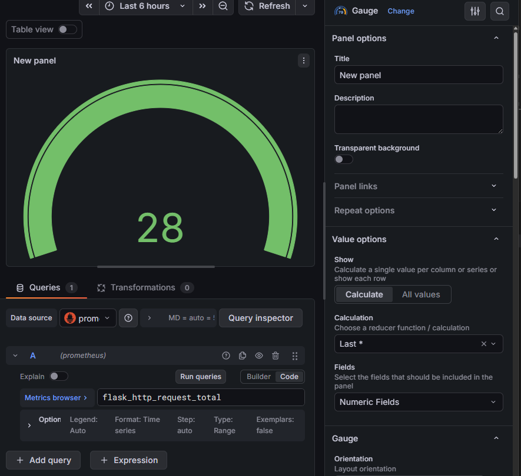

# Curso DevOps Prático - E-commerce com Docker

Este projeto é um servidor web simples utilizando **Python** e **Flask**, totalmente containerizado com **Docker**.

## 🚀 Como rodar o projeto

Certifique-se de ter o Docker e o Docker Compose instalados.

1. Clone o repositório:
   ```bash
   git clone https://github.com/EngSivaldo/curso-devops-pratico.git
   ```

2. Entre na pasta:
   ```bash
   cd curso-devops-pratico
   ```

3. Suba o ambiente:
   ```bash
   docker compose up --build
   ```

4. Acesse no seu navegador:
   [http://localhost:8080](http://localhost:8080)

## 🛠️ Tecnologias Utilizadas
* **Docker**: Para isolamento do ambiente.
* **Flask**: Framework web em Python.
* **GitHub Actions**: Para integração contínua (CI).


curso-devops/
├── docker-compose.yml     # Orquestrador (Infra)
├── Dockerfile             # Receita da Imagem (App)
├── nginx/
│   └── nginx.conf         # Configuração do Proxy (Rede)
└── src/                   # Código Fonte
    ├── wsgi.py            # Ponto de entrada (Entrypoint)
    └── app/               # O pacote da aplicação
        ├── __init__.py    # A Fábrica (Factory)
        ├── routes.py      # As rotas (Lógica)
        └── templates/     # A cara do site (HTML)


## 📊 Monitoramento e Observabilidade
O projeto utiliza a stack **Prometheus + Grafana** para monitoramento em tempo real:
- **Prometheus**: Coleta métricas da aplicação Flask (ex: total de requisições, tempo de resposta).
- **Grafana**: Dashboard visual para análise de performance e saúde da aplicação.

### Como visualizar:
1. Após subir o ambiente com `docker compose up -d`.
2. Acesse o Grafana em `http://localhost:3000`.
3. Importe ou visualize o dashboard pré-configurado.
## 📊 Monitoramento e Observabilidade

Projeto integrado com Prometheus e Grafana para métricas em tempo real.

## 🚀 Automação e Qualidade (CI/CD)
Este projeto utiliza **GitHub Actions** (`ci.yml`) para garantir a integridade do código em cada push:
- **Linting (Flake8)**: Verificação automática de padrões de código Python (PEP 8) [cite: 2026-02-22].
- **Segurança (Bandit)**: Análise estática em busca de vulnerabilidades e chaves expostas [cite: 2026-02-22].
- **Docker Build Check**: Validação automática da construção da imagem Docker [cite: 2026-03-08].

## 🔐 Segurança
As variáveis de ambiente sensíveis são gerenciadas via arquivo `.env` (não versionado) para seguir as melhores práticas de segurança [cite: 2026-02-22].
